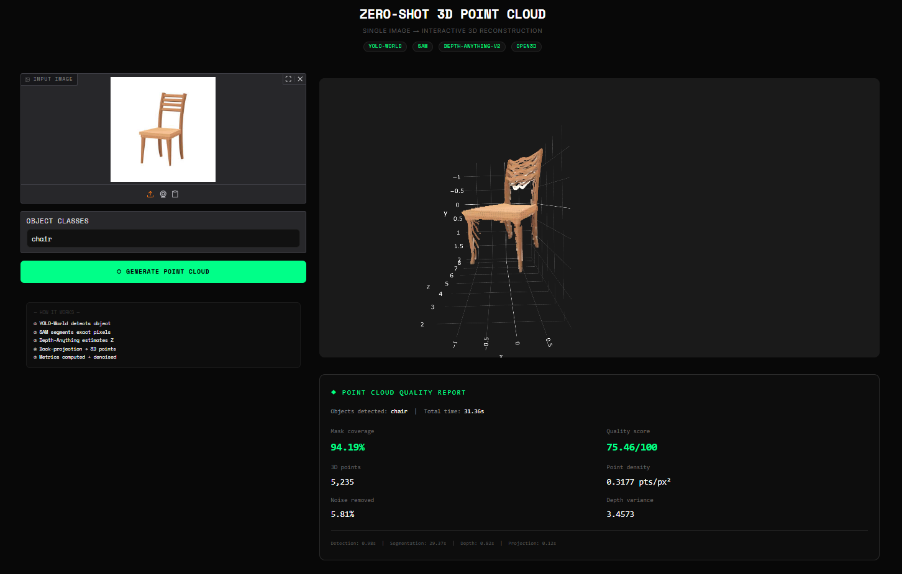
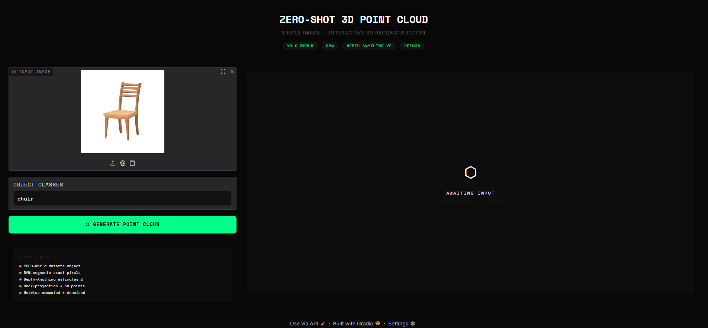
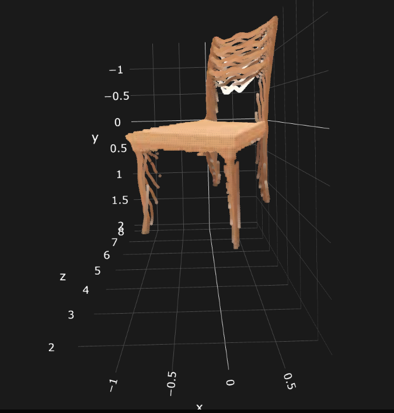
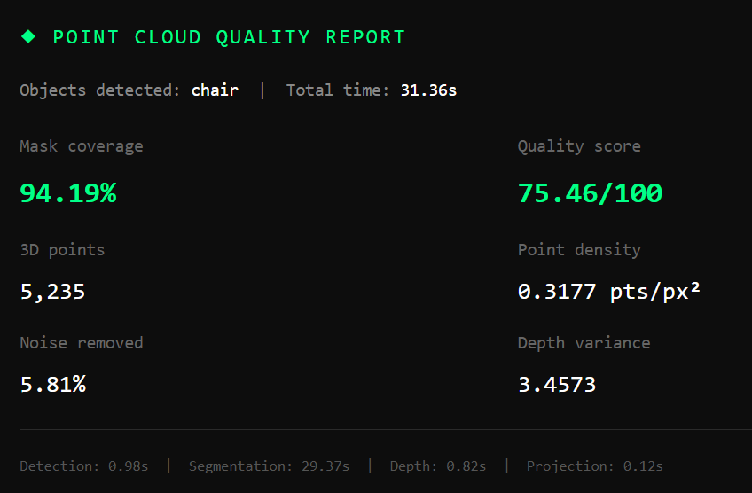

<div align="center">

# ⬡ Zero-Shot 3D Point Cloud Generation

**Reconstruct interactive 3D point clouds from a single 2D image using natural language.**  
No training data. No depth sensor. No camera calibration.



<br/>


</div>

---

## What Is This?

Type any object name. Upload any photo. Get a fully interactive, rotatable 3D point cloud — rendered directly in your browser.

The pipeline chains four state-of-the-art models end-to-end:
- **YOLO-World** detects the object with open-vocabulary recognition (no fixed class list)
- **SAM** (Segment Anything) isolates exact pixels belonging to the object
- **Depth-Anything-V2** estimates per-pixel depth from a single RGB image
- **Custom back-projection module** converts 2D pixels + depth → 3D coordinates

Every run produces a quality report with real metrics — coverage, density, noise ratio, and a composite quality score.

---

## Demo

<div align="center">

&nbsp;&nbsp;

<br/>
<sub>Left: Input image loaded in UI &nbsp;|&nbsp; Right: Generated 3D point cloud</sub>
</div>

<br/>

<div align="center">

<br/>
<sub>Quality metrics report generated for every run</sub>
</div>

---

## Results

| Image | Object | Mask Coverage | Quality Score | 3D Points | Time (CPU) |
|---|---|---|---|---|---|
| Wooden chair | chair | **94.19%** | **75.46/100** | 5,235 | ~31s |

---

## Pipeline Architecture

```
┌─────────────────────────────────────────────────────────┐
│                     INPUT                               │
│          RGB Image  +  Class Name ("chair")             │
└──────────────────────┬──────────────────────────────────┘
                       │
                       ▼
┌─────────────────────────────────────────────────────────┐
│  STAGE 1 — Object Detection        [detection.py]       │
│  YOLO-World open-vocabulary detector                    │
│  → Bounding box [x1, y1, x2, y2]                       │
│  → Confidence score                                     │
└──────────────────────┬──────────────────────────────────┘
                       │
                       ▼
┌─────────────────────────────────────────────────────────┐
│  STAGE 2 — Pixel Segmentation      [segmentation.py]    │
│  SAM (ViT-H) prompted with bounding box                 │
│  → Boolean mask (H × W)                                 │
│  → Per-pixel object boundary at 0.990 confidence        │
└──────────────────────┬──────────────────────────────────┘
                       │
                       ▼
┌─────────────────────────────────────────────────────────┐
│  STAGE 3 — Depth Estimation        [depth.py]           │
│  Depth-Anything-V2 monocular depth                      │
│  → Per-pixel depth map (H × W) in meters                │
│  → EXIF-based camera intrinsics (fx, fy, cx, cy)        │
└──────────────────────┬──────────────────────────────────┘
                       │
                       ▼
┌─────────────────────────────────────────────────────────┐
│  STAGE 4 — 3D Back-Projection      [projection.py]      │
│  X = (u - cx) × Z / fx                                  │
│  Y = (v - cy) × Z / fy                                  │
│  Bilateral filter → statistical outlier denoising       │
│  → Open3D point cloud (.ply + interactive HTML)         │
└──────────────────────┬──────────────────────────────────┘
                       │
                       ▼
┌─────────────────────────────────────────────────────────┐
│  STAGE 5 — Quality Metrics         [metrics.py]         │
│  Coverage %, density, depth variance, noise ratio       │
│  → Composite quality score (0–100)                      │
│  → metrics.json for run history                         │
└─────────────────────────────────────────────────────────┘
```

---

## Key Technical Contributions

### 1. EXIF-Based Camera Intrinsics Estimation
Most implementations hardcode `fx = fy = 500px` — incorrect for real cameras and a source of geometric distortion in point clouds. This pipeline extracts true focal length from image EXIF metadata and converts mm → pixels using focal plane resolution data, falling back to a principled heuristic `fx = max(H, W)` when EXIF is unavailable.

### 2. Five-Metric Quality Scoring System

| Metric | Formula | What It Measures |
|---|---|---|
| Mask coverage | `valid_3D_pts / mask_pixels × 100` | % of segmented pixels that became 3D points |
| Point density | `valid_3D_pts / bbox_area` | Spatial density within bounding box |
| Depth variance | `var(depth[mask])` | 3D structural complexity captured |
| Noise ratio | `(before - after) / before × 100` | % outliers removed by denoising |
| Quality score | `0.5×coverage + 0.3×density + 0.2×(100-noise)` | Weighted composite (0–100) |

### 3. Bilateral Filter Pre-processing
Depth maps from monocular estimation contain high-frequency noise at object boundaries. A bilateral filter smooths depth values while preserving edges — producing cleaner point cloud silhouettes without losing structural detail.

### 4. Modular Pipeline Architecture
Each stage is an independent, testable module with a clean interface. Swap any model (e.g. replace Depth-Anything-V2 Small with Large) by changing one line in `pipeline.py`.

---

## Project Structure

```
zero-shot-3d-point-cloud/
├── src/
│   ├── detection.py       # YOLO-World open-vocabulary detector
│   ├── segmentation.py    # SAM pixel-level segmentation + download utility
│   ├── depth.py           # Depth-Anything-V2 + EXIF intrinsics extraction
│   ├── projection.py      # Back-projection, denoising, PLY + HTML export
│   ├── metrics.py         # Quality metrics + run history tracking
│   └── pipeline.py        # End-to-end orchestration with timing
├── assets/                # Screenshots and demo images
├── notebooks/             # Original research notebook
├── app.py                 # Gradio web interface
└── requirements.txt
```

---

## Setup & Installation

```bash
# Clone
git clone https://github.com/Annu-UI/zero-shot-3d-point-cloud.git
cd zero-shot-3d-point-cloud

# Environment (Python 3.11 required — open3d not yet on 3.12+)
python -m venv venv
venv\Scripts\activate        # Windows
source venv/bin/activate     # Linux / Mac

# Dependencies
pip install -r requirements.txt

# Download SAM weights (~2.4GB, one-time)
python -c "from src.segmentation import download_sam; download_sam()"

# Launch
python app.py
# Open http://127.0.0.1:7860
```

---

## Usage

1. Open `http://127.0.0.1:7860`
2. Upload any RGB image
3. Enter object class — e.g. `chair`, `person`, `bottle`, `car`
4. Click **Generate Point Cloud**
5. Interact with the 3D viewer directly in browser — rotate, zoom, pan
6. View the quality metrics report below the viewer

---

## Tech Stack

| Layer | Technology |
|---|---|
| Object Detection | YOLO-World (Ultralytics) |
| Instance Segmentation | Segment Anything Model — ViT-H |
| Depth Estimation | Depth-Anything-V2 Small (HuggingFace) |
| 3D Processing | Open3D |
| Visualization | Plotly (embedded HTML) |
| Web Interface | Gradio |
| Deep Learning | PyTorch 2.0 |

---

## Limitations & Future Work

- Depth estimation is relative, not metric — absolute scale is approximate
- Single-view reconstruction misses occluded surfaces
- Inference runs ~31s on CPU — GPU reduces this to ~3-5s
- Planned: multi-view ICP fusion for complete object reconstruction

---

## Author

**Annu Kumari**  
B.Tech Mathematics and Computing, IIT Guwahati  
[LinkedIn](https://linkedin.com/in/annu-kumari-b5098a332) &nbsp;|&nbsp; [GitHub](https://github.com/Annu-UI)
